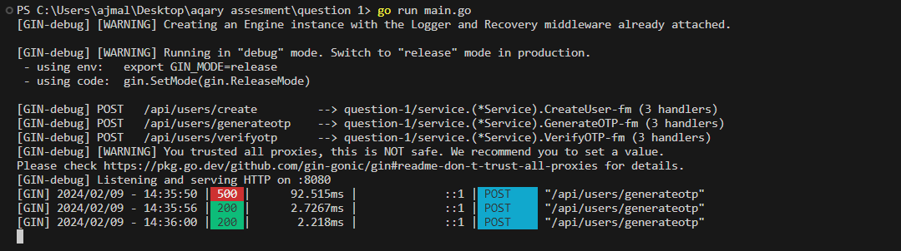
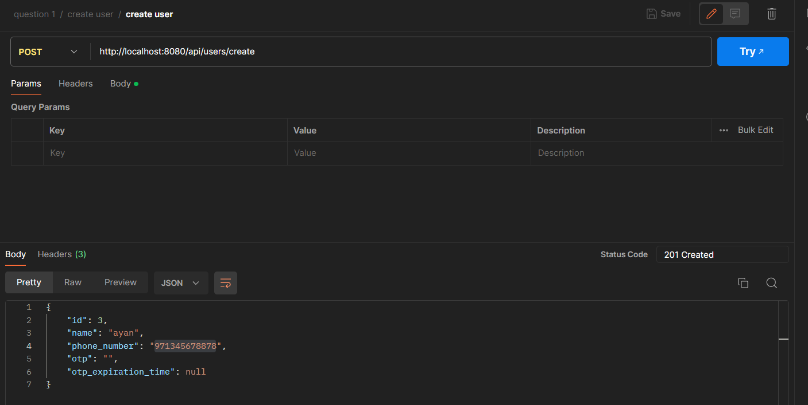
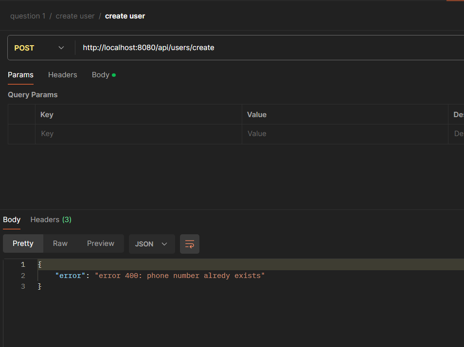
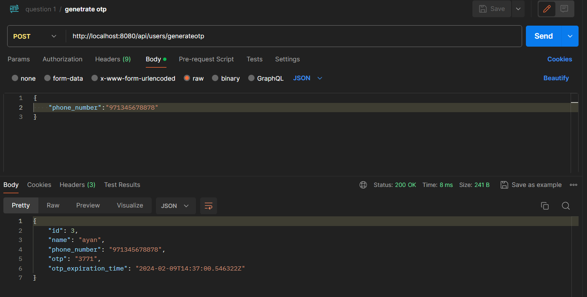
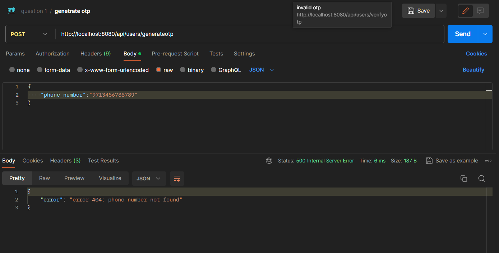
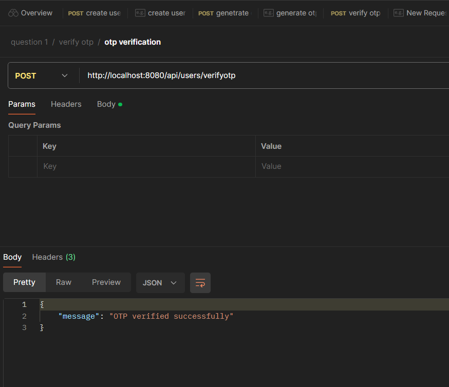
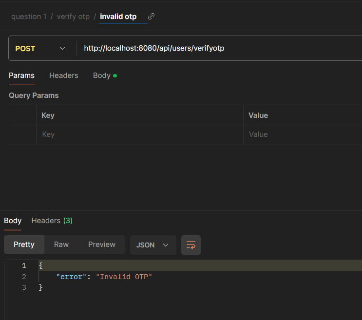

# aquary-question-4
Assesment question number 1 given by aqary international group

Question # 1

### Test Task: Building a REST API using Gin and PostgreSQL and SQLC

Objective:

Your task is to implement a RESTful API using Golang with the Gin framework and PostgreSQL as the database and pgx as a database driver and sqlc for
queries. 
The API should provide functionality to create a user, generate OTP for the user, and verify the OTP.

Requirements

1. Setup:

Set up a PostgreSQL database.

Create a table named "users" with the following fields:

`id` (serial): Unique identifier for a user.
`name` (string): Name of the user.
`phone_number` (string): Phone number of the user (unique).
`otp` (string): OTP generated for the user.
`otp_expiration_time` (timestamp): Expiry time for the OTP.

2. Gin Server

Use Gin to create an HTTP server.
Implement the following routes:
`POST /api/users`: Create a new user.
Accepts JSON payload with `name` and `phone_number`.
Ensure that `phone_number` is unique; if not, return a 400 error.
Store the user in the database.
`POST /api/users/generateotp`: Generate OTP for a user.
Accepts JSON payload with `phone_number`.
If the `phone_number` does not exist, return a 404 error.
-- Generate a random 4--digit OTP and set its expiration time to 1 minute from the current time.
-- `POST /api/users/verifyotp`: Verify OTP for a user.
-- Accepts JSON payload with `phone_number` and `otp`.
-- Check if the OTP is correct and not expired (compare with `otp_expiration_time`).
-- If the OTP is correct and not expired, return a success message.
-- If the OTP is incorrect, return an error message.
-- If the OTP is expired, return an error message indicating that the OTP has expired.

3. Database Operations

-
- Use `pgx` as the PostgreSQL driver.
- Use transactions for queries in Golang

- Utilize `sqlc` to generate type--safe Go code from SQL queries.
-
- Implement functions to:
-- Create a new user with proper data validation.
-- Generate a new OTP for a user.
-- Verify OTP for a user.

output:-

postman collection url:-

https://www.postman.com/crimson-comet-427147/workspace/aqary/collection/26999900-5286ed87-4cd5-43d0-a4f8-98294e7825c4

Server is running successfully:=

Create user successfully:=

Create user - phone number already exists:=

Generate otp successfull:=

Generate otp - phone number not found:=

Verify otp successfull:=

Verify otp invalid:=

